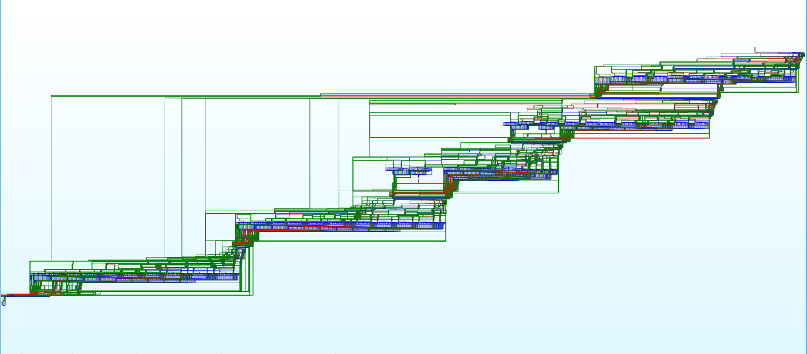

# Srungoat Protection Library

An advanced protection library for Windows applications, providing multiple layers of security against reverse engineering and debugging.

## Table of Contents
- [Fast features list](#fast-features)
- [Main Protections](#main-protections)
- [Obfuscation Macros](#obfuscation-macros)
- [String Encryption and Protection](#string-encryption-and-protection)
- [Watermarking and Signatures](#watermarking-and-signatures)
- [Junk Code and Anti-Analysis](#junk-code-and-anti-analysis)
- [Advanced Configuration](#advanced-configuration)
- [Usage](#usage)
- [IDA Examples with JUNK Code](#ida-examples-with-junk-code)
- [License](#license)

## fast features

Anti-Debug
Anti-Dump
Anti-DLL Injection
Anti-API Hook
Anti-IAT Hook
Anti-Thread Manipulation (suspension/termination)
Anti-Code Patch
SEH Protection (Structured Exception Handling)
Section Integrity Check
String Obfuscation (via OBF macro)
Junk Code Generation (multiple levels)
Fake Signatures (to fool analyzers)
Section Watermarking
Analysis Tools Detection (IDA, debuggers, etc.)
Suspicious Parent Process Detection
Breakpoint Protection (hardware/software)
PE Header Integrity Check
Memory Modification Detection
Memory Dump Protection
Critical Thread Monitoring


## Main Protections

### Anti-Debug Protection
```cpp
START_ANTI_DEBUG
```
- Debugger detection (IsDebuggerPresent)
- Remote debugger detection (CheckRemoteDebuggerPresent)
- Hardware breakpoint detection (Dr0-Dr7)
- Software breakpoint detection (INT3/0xCC)
- Suspicious parent process verification
- Analysis tools detection (OllyDbg, x64dbg, IDA, etc.)
- Thread context modification protection

### Anti-Dump Protection
```cpp
START_ANTI_DUMP_AND_SEH
```
- PE header corruption
- Import/export table protection
- Memory dump attempt monitoring
- SEH chain protection
- Header sensitive data corruption
- Memory dump tools protection

### Anti-Injection Protection
```cpp
START_ANTI_DLL_INJECTION
```
- Loaded modules monitoring
- System DLL verification
- Automatic unauthorized DLL unloading
- DLL path verification
- System DLL whitelist
- LoadLibrary protection

### Anti-Modification Protection
```cpp
START_ANTI_CODE_PATCH
```
- .text section protection
- Automatic modified code restoration
- Code integrity verification
- Memory modification protection
- Executable sections monitoring

### Anti-Hook Protection
```cpp
START_ANTI_API_HOOK
```
- Critical Windows functions protection
- Inline hook detection
- Modified functions restoration
- Function entry point protection
- Function first bytes verification

### Anti-IAT Hook Protection
```cpp
START_ANTI_IAT_HOOK
```
- Import table protection
- Modified entries restoration
- Import address verification
- IAT modification protection
- Pointer modification monitoring

### Thread Protection
```cpp
START_ANTI_PAUSE_THREAD
START_ANTI_TERMINATE_THREAD
```
- Suspension protection
- Termination protection
- Thread state monitoring
- Suspended threads restoration
- Thread context verification

### Anti-Analysis Protection
```cpp
START_ANTI_WINDOW_TITLE
```
- Debugger window detection
- Suspicious titles monitoring
- Analysis tools protection
- Analysis window detection

## Obfuscation Macros

### Simple Junk Code
```cpp
JUNK                    // Basic junk code
PYRAMID_JUNK           // Pyramidal junk structure
ZIGZAG_JUNK           // Zigzag junk pattern
COOL_JUNK             // Optimized junk code
JUNK_SHIP_SPACIAL     // Complex junk
JUNK_FUCK_IDA         // IDA anti-disassembly
BUG_IDA               // IDA confusion
```

### Advanced Junk Code
```cpp
ULTRA_MEGA_JUNK(x)    // Ultra complex junk
Junkyyyyyyy(x)        // Alternative junk
dickyy(x)             // Triple junk
JUNK_VAR              // Junk variables
```

### Protected Calls
```cpp
CALL(expr)             // Function bool string etc.. call protection
CALL_VOID(expr)       // Function void call protection
CALL_RANDOM_JUNK     // Random junk between calls
```

## String Encryption and Protection

### Simple Encryption
```cpp
OBF(str)              // Basic encryption
```

### Advanced Encryption
```cpp
KEyy(str, key1, key2) // Key-based encryption
```

### Character Conversion
```cpp
CONVERT_STRING(str)    // Accent conversion
```

## Watermarking and Signatures

### Watermarks
```cpp
WATERMARK(watermark)   // Simple watermark
WATERMARK_UNIQUE_NAME(prefix) // Unique watermark
```

### Section Signatures
```cpp
Name_Of_Sections_watermark  // Section name signature
SIGNATURE[]               // Binary signature
```

## Advanced Configuration

### Protection Levels
```cpp
#define JUNK_ON_OBF 1           // Enable obfuscation
#define JUNK_ON_OBF_LEVEL 1     // Level (0-3)
#define CALL_LEVEL 1            // Call protection
#define FAKE_SIGNATURES 1       // Deceptive signatures
```

### Protected Sections
```cpp
.arch
.srdata
.xpdata
.xdata
.xtls
.themida
.vmp0
.vmp1
.vmp2
.enigma1
.enigma2
.dsstext
```

### Protection Constants
```cpp
JUNK_PRIME_1 0x1337DEAD
JUNK_PRIME_2 0xDEADBEEF
JUNK_PRIME_3 0xBADC0FEE
JUNK_PRIME_4 0xCAFEBABE
```

## Usage

### Installation
1. Include the header file:
```cpp
#include "srungoat.h"
```

### Complete Initialization
```cpp
int main() {
    // Integrity checks
    START_INTEGRITY_CHECK;
    
    // Anti-debug and anti-dump protections
    START_ANTI_DEBUG;
    START_ANTI_DUMP_AND_SEH;
    
    // Anti-injection and anti-patch protections
    START_ANTI_DLL_INJECTION;
    START_ANTI_CODE_PATCH;
    
    // Anti-hook protections
    START_ANTI_API_HOOK;
    START_ANTI_IAT_HOOK;
    
    // Thread protections
    START_ANTI_PAUSE_THREAD;
    START_ANTI_TERMINATE_THREAD;
    
    // Anti-analysis protection
    START_ANTI_WINDOW_TITLE;
    
    // Code protection
    WATERMARK("Application Protected");
    const char* secret = OBF("Secret Data");
    
    // Add junk code
    JUNK;
    ULTRA_MEGA_JUNK(0);
    
    // Your code...
    return 0;
}
```

### Sensitive String Protection
```cpp
// Simple encryption
const char* password = OBF("MyPassword");

// Key-based encryption
const char* key = KEyy("SecretKey", __TIME__[4], __TIME__[7]);

// Secure conversion
const char* text = CONVERT_STRING("Text with accents éèà");
```

### Adding Junk Code
```cpp
void sensitive_function() {
    JUNK;                    // Simple junk
    ULTRA_MEGA_JUNK(0);      // Complex junk
    // Sensitive code
    PYRAMID_JUNK;           // More junk
    BUG_IDA;                // Anti-disassembly
}
```

### Call Protection
```cpp
void protected_function() {
    CALL(sensitive_function());   // Protected call
    CALL_RANDOM_JUNK;           // Random junk
}
```

## Important Notes

### Performance
- Protections run in separate threads
- Heavy use of junk code can impact performance
- String encryption adds minimal overhead
- Integrity checks are periodic

### Security
- All protections are cumulative
- Protections can be detected by advanced tools
- Obfuscation makes analysis harder but not impossible
- Use multiple protection layers for better security

### Compatibility
- Windows x64 only
- Visual Studio 2019+
- Requires administrator rights
- May interfere with some antiviruses

### Limitations
- No x86 support
- Some protections can be bypassed
- Debug performance impact
- Increased binary size

## Warning

This library is designed for legitimate reverse engineering protection. Any malicious use is strictly prohibited. Protections are not 100% guaranteed effective against determined attackers.

## System Requirements

### Minimum Requirements
- Windows 10 x64 or later
- Visual Studio 2019 or later
- Administrator privileges
- 4GB RAM minimum
- x64 processor

### Development Requirements
- Windows SDK 10.0 or later
- C++17 compatible compiler
- CMake 3.15 or later
- Git (optional, for version control)

## Detailed Installation

### Manual Installation
1. Clone or download the repository
2. Copy `srungoat.h` to your project's include directory
3. Add the include directive in your source files:
```cpp
#include "srungoat.h"
```
4. Configure your project settings:
   - Set platform to x64
   - Enable C++17 features
   - Add required Windows SDK libraries

### Using with CMake
```cmake
# Add to your CMakeLists.txt
add_library(srungoat INTERFACE)
target_include_directories(srungoat INTERFACE ${CMAKE_CURRENT_SOURCE_DIR}/include)
target_compile_features(srungoat INTERFACE cxx_std_17)
```

## Advanced Usage Examples

### Custom Protection Chain
```cpp
int main() {
    // Custom initialization order
    START_INTEGRITY_CHECK;
    START_ANTI_DEBUG;
    
    // Custom watermarking
    WATERMARK("Custom Protection v1.0");
    WATERMARK_UNIQUE_NAME(MyApp);
    
    // Multiple string protections
    const char* key1 = OBF("Key1");
    const char* key2 = KEyy("Key2", __TIME__[4], __TIME__[7]);
    const char* key3 = CONVERT_STRING("Sécurité");
    
    // Advanced junk code patterns
    JUNK_FUCK_IDA;
    for(int i = 0; i < 10; i++) {
        PYRAMID_JUNK;
        // Your code here
        ZIGZAG_JUNK;
    }
    
    return 0;
}
```

### Thread-Safe Protection
```cpp
void protected_thread_function() {
    START_ANTI_PAUSE_THREAD;
    START_ANTI_TERMINATE_THREAD;
    
    while(true) {
        JUNK_VAR;
        // Your thread code here
        CALL_RANDOM_JUNK;
        Sleep(100);
    }
}
```

### Custom Protection Levels
```cpp
// Configure protection levels
#define JUNK_ON_OBF_LEVEL 3  // Maximum obfuscation
#define CALL_LEVEL 2         // Medium call protection
#define FAKE_SIGNATURES 1    // Enable fake signatures

int main() {
    // Initialize with custom levels
    START_INTEGRITY_CHECK;
    START_ANTI_DEBUG;
    
    // Your protected code here
    
    return 0;
}
```

## Troubleshooting

### Common Issues

1. **Antivirus False Positives**
   - Add exclusions for your development directory
   - Temporarily disable real-time protection during development
   - Use code signing if available

2. **Performance Issues**
   - Reduce JUNK_ON_OBF_LEVEL
   - Limit the use of heavy junk code in critical sections
   - Use selective protection for sensitive parts only

3. **Compilation Errors**
   - Verify Visual Studio version compatibility
   - Check Windows SDK installation
   - Ensure x64 platform is selected
   - Verify all required headers are available

4. **Runtime Errors**
   - Check administrator privileges
   - Verify all DLL dependencies
   - Monitor system resources usage
   - Check for conflicting security software

### Debug Mode
For development purposes, you can define DEBUG_PROTECTION:
```cpp
#define DEBUG_PROTECTION 1  // Enable protection debugging
```

## Security Best Practices

1. **Layer Protection**
   - Combine multiple protection types
   - Use different encryption methods for different data
   - Implement custom protection patterns

2. **Update Regularly**
   - Monitor for new protection bypasses
   - Update encryption keys periodically
   - Maintain protection configurations

3. **Custom Implementation**
   - Modify default protection patterns
   - Create unique junk code sequences
   - Implement application-specific checks

4. **Monitoring**
   - Log protection events
   - Monitor for unusual behavior
   - Implement custom error handling

## Contributing

### Development Guidelines
1. Fork the repository
2. Create a feature branch
3. Follow the coding style
4. Add tests for new features
5. Submit a pull request

### Testing
- Run the test suite
- Verify x64 compatibility
- Check performance impact
- Test with different VS versions

## IDA Examples with JUNK Code

Here are some examples showing how JUNK code appears in IDA Pro, demonstrating its effectiveness in obfuscation:

### Example: Simple JUNK (print "hello world")





These images demonstrate how even a simple "hello world" program becomes significantly more complex and harder to analyze when protected with our JUNK code features. The obfuscation creates multiple fake code paths and confusing patterns that make reverse engineering much more challenging. 

## License

Custom License – Non-Commercial Source Distribution

Copyright (c) 2025 srungot

Permission is hereby granted to any person obtaining a copy of this software (the "Software") to use, copy, modify, and distribute both original and modified versions of the source code under the following conditions:

1. You may:
   - Use the Software for personal, educational, or commercial purposes.
   - Modify the Software and distribute modified versions freely.
   - Include the Software in commercial products, provided the source code itself is not sold.

2. You may NOT:
   - Sell or license the original or modified source code, on its own or as part of a source distribution.
   - Use the Software in a product where access to the source code is sold or restricted commercially.

3. Distribution of modified versions must include this license and clearly indicate changes made to the original.

By using this Software, you agree to these terms.

This is a custom license and is not OSI-approved.
